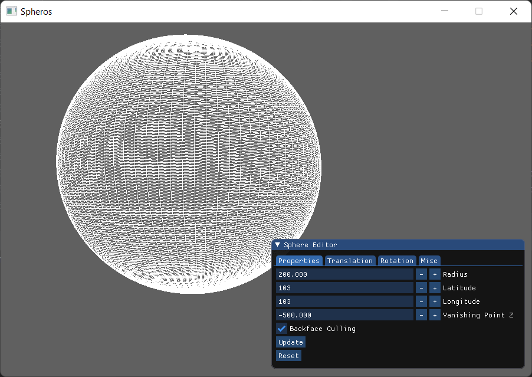
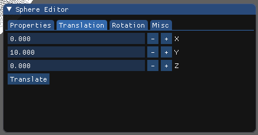
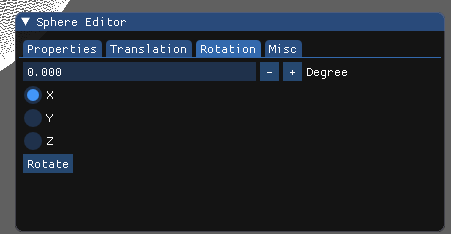
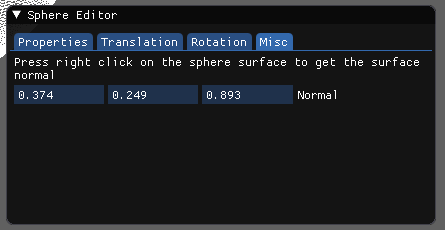

# Spheros

A sphere 3D model construction wireframe renderer.

Project specification: https://drive.google.com/file/d/1oc3v2uTZPibaaAwLHdLKjV-XXGah59pA/view?usp=sharing

## Features

- Preview the 3D sphere in real time
- Translation
- Rotation
- Get sphere surface normal

## Screenshot

## License

Licensed under [GNU GPL-v3](LICENSE)
